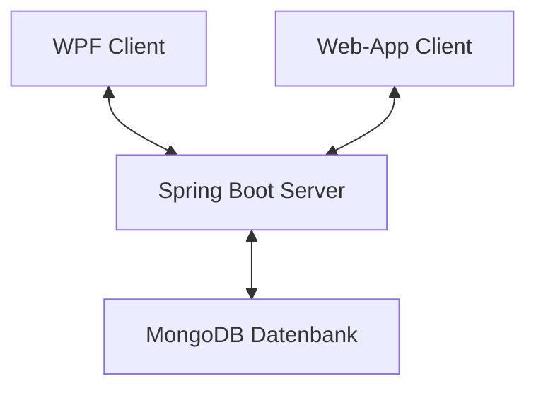
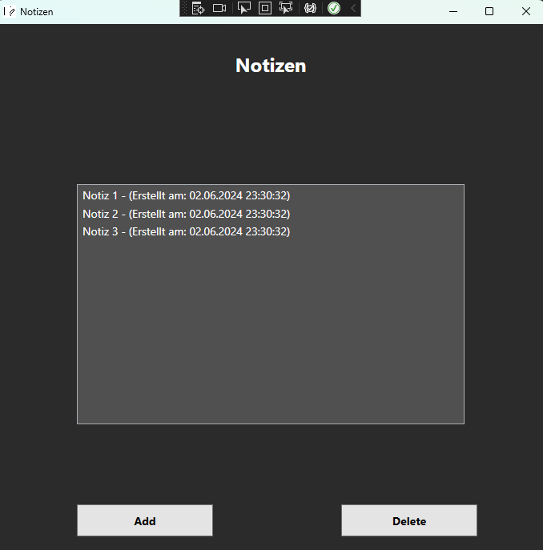
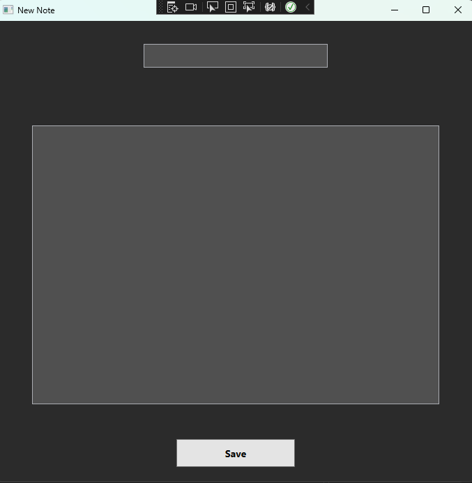
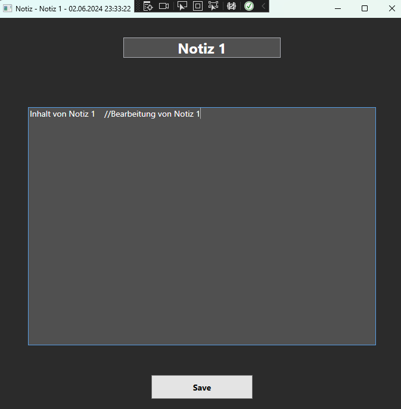
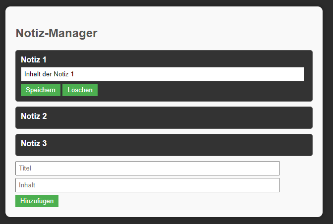
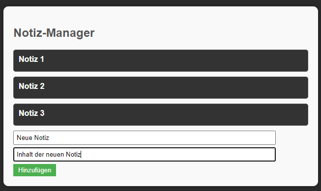
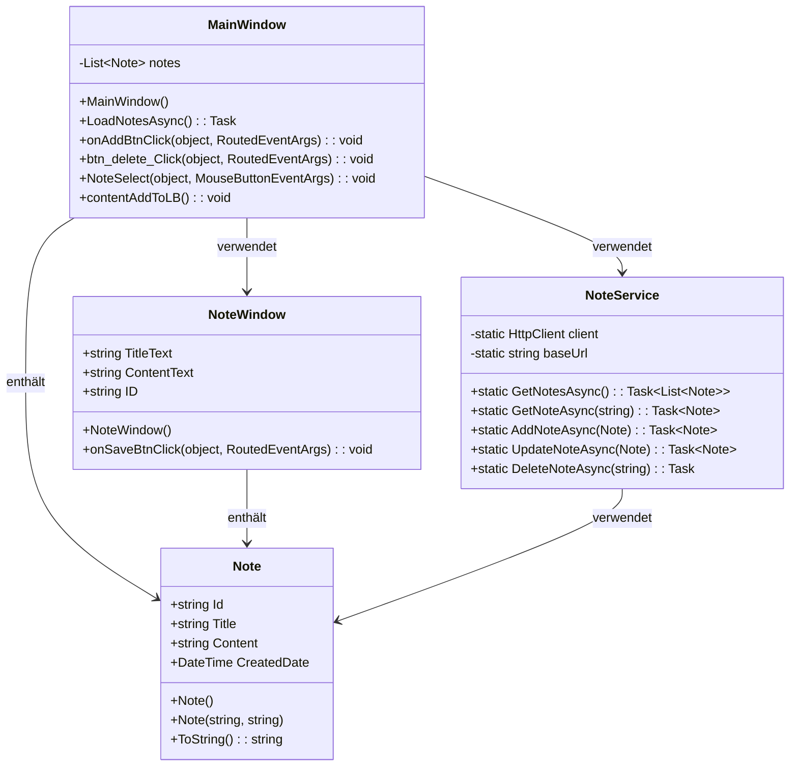
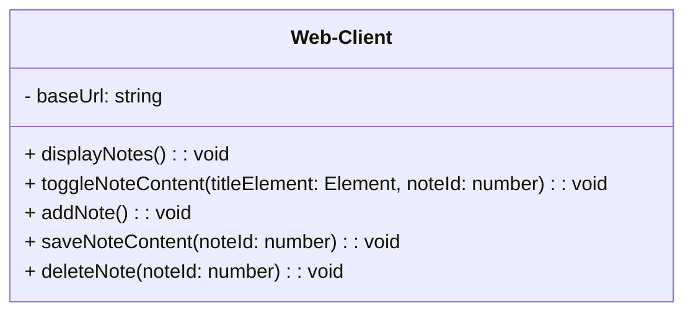
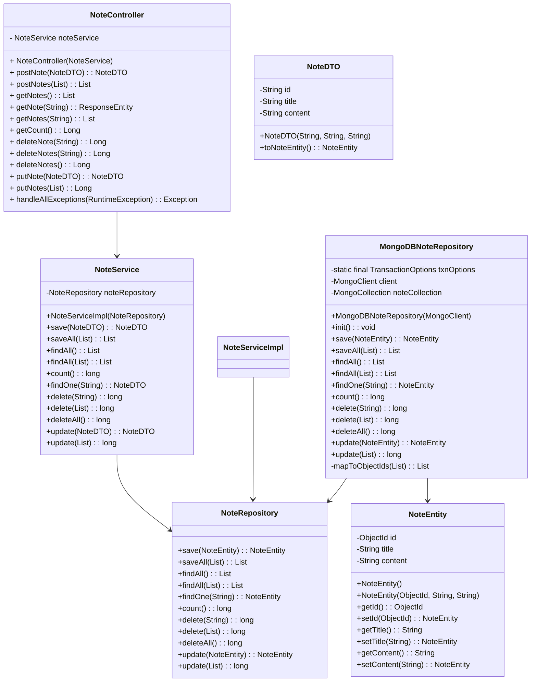

# POS-Semesterprojekt Dokumentation

## Architektur des Projekts
In diesem Projekt wird über eine WPF-Anwendung in C# (Client) und einer Web-Anwendung (Client) auf einen Spring Boot Server zugegriffen welcher Notizdaten aus einer MongoDB-Datenbank auslesen, verändern, löschen und hinzufügen kann. Es wurde also in einer Client-Client-Server-Architektur entwichelt. Hier ein Überblick der Architektur:



## Beschreibung der Notiz-App

Die Notiz-App ist eine vielseitige und benutzerfreundliche Anwendung, die entwickelt wurde, um Benutzern eine einfache und effiziente Möglichkeit zu bieten, ihre Notizen zu erstellen, zu verwalten und zu organisieren. Die App ist sowohl als Desktop-Anwendung (WPF) als auch als Webanwendung verfügbar, wodurch sie flexibel auf verschiedenen Geräten genutzt werden kann.

### Hauptfunktionen

1. **Erstellen von Notizen:**
   Benutzer können neue Notizen erstellen, indem sie Titel und Inhalt eingeben. Die Notizen können Texte, Listen, Links und andere Informationen enthalten, die für den Benutzer wichtig sind.

2. **Bearbeiten von Notizen:**
   Bestehende Notizen können jederzeit bearbeitet werden. Benutzer können den Inhalt aktualisieren, Änderungen speichern und die Notizen bei Bedarf neu organisieren.

3. **Löschen von Notizen:**
   Benutzer können Notizen, die sie nicht mehr benötigen, löschen. Diese Funktion hilft dabei, die Notizenliste sauber und organisiert zu halten.

4. **Liste von Notizen:**
   Alle Notizen werden in einer übersichtlichen Liste angezeigt. Benutzer können schnell durch ihre Notizen blättern, nach spezifischen Notizen suchen und direkt auf eine Notiz klicken, um sie anzuzeigen oder zu bearbeiten.

5. **Synchronisation zwischen Geräten:**
   Die Notiz-App synchronisiert Notizen zwischen der Desktop-Anwendung und der Webanwendung. Dadurch haben Benutzer stets Zugriff auf ihre aktuellen Notizen, unabhängig davon, welches Gerät sie verwenden.

### Benutzeroberfläche

Die Benutzeroberfläche der Notiz-App ist intuitiv gestaltet und ermöglicht eine einfache Navigation und Nutzung. Die Hauptfunktionen sind über klare und verständliche Schaltflächen zugänglich, und die Notizen werden in einer strukturierten und übersichtlichen Weise präsentiert.

### Technische Details

Die WPF-Anwendung bietet eine native Windows-Benutzererfahrung, während die Webanwendung plattformübergreifend in jedem modernen Browser läuft. Beide Clients kommunizieren mit einem zentralen Spring Boot-Server, der die Backend-Logik und die Verbindung zur MongoDB-Datenbank bereitstellt.

### Vorteile der Notiz-App

- **Flexibilität:** Benutzer können die App auf verschiedenen Geräten und Plattformen nutzen, wodurch sie ihre Notizen überall und jederzeit zur Hand haben.
- **Benutzerfreundlichkeit:** Die einfache und intuitive Benutzeroberfläche macht es auch weniger technisch versierten Benutzern leicht, die App zu nutzen.
- **Sicherheit:** Durch die Verwendung von MongoDB und Spring Boot wird sichergestellt, dass die Notizen sicher gespeichert und verarbeitet werden.
- **Effizienz:** Funktionen wie das schnelle Suchen und Bearbeiten von Notizen sparen Zeit und erhöhen die Produktivität.

## Erklärung der Notiz-App
### WPF-Anwendung
#### Übersicht


In der Mitte der Übersicht befinden sich alle aktuell in der Datenbank bestehenden Notizen. 
Mit dem Button Add kann man in einem neuen Fenster eine Neue Notiz erstellen und in die Datenbank hinzufügen.
Mit dem Button Delete kann man eine aktuell ausgewählte Notiz aus der Datenbank löschen.
Mit Doppelklick auf eine Notiz kann man diese verändern.

#### Add


Wenn der Button Add gedrückt wird öffnet sich ein Fenster wo man Titel und Content der Notiz eingeben kann, mit dem Save Butten der unten erscheint kann man die eingabe in der Datenbank speichern und in die Liste der Notes hinzufügen.

#### Bearbeiten


Mit einem Doppelklick auf eine Notiz kann diese verändert werden, Mit dem Save Button der unten erscheint kann die Änderung in der Datenbank gespeichert werden und die Liste der Notizen wird dementsprechend aktualisiert.

#### Klassen
### MainWindow.xaml.cs
Die `MainWindow.xaml.cs` Klasse steuert das Hauptfenster der WPF-Anwendung. Sie lädt beim Start Notizen, ermöglicht das Hinzufügen, Bearbeiten und Löschen von Notizen und aktualisiert die Benutzeroberfläche entsprechend.

### MainWindow.xaml
Die `MainWindow.xaml` definiert die Benutzeroberfläche des Hauptfensters, einschließlich der Anordnung der Steuerelemente wie ListBox, Buttons usw.

### NoteWindow.xaml.cs und NoteWindow.xaml
Die `NoteWindow.xaml.cs` und `NoteWindow.xaml` Dateien sind verantwortlich für das Hinzufügen und Bearbeiten einzelner Notizen. Sie zeigen Eingabefelder für den Titel und den Inhalt der Notiz an.

### NoteService
Der `NoteService` behandelt die Kommunikation mit dem Server für CRUD-Operationen von Notizen. Er verwendet HTTP-Anfragen, um mit den entsprechenden Endpunkten auf dem Server zu interagieren.

### Note
Die `Note` Klasse repräsentiert eine einzelne Notiz mit Eigenschaften wie Titel und Inhalt.


### Web App
Die Webanwendung bietet eine plattformunabhängige Möglichkeit, auf die Notizen zuzugreifen und sie zu verwalten. Hier sind die Hauptkomponenten des Web-Clients.
#### Übersicht


Unter der Überschrift Notiz-Manager sieht man die Liste der bestehenden Notizen die aktuell in der Datenbank gespeichert sind.
Darunter sieht man die Eingabefelder für Titel und Inhalt für eine neue Notiz, mit hinzufügen wird diese dann in die Datenbank gespeichert. 
Durch Klick auf den Titel der Notiz kann man diese bearbeiten und löschen.

#### Add


Über die 2 Eingabefelder unten kann man eine neue Notiz hinzufügen und in der Datenbank speichern.
### index.html
Die `index.html` Datei ist die Hauptdatei der Webanwendung. Sie definiert die Benutzeroberfläche und enthält das HTML-Grundgerüst, das für die Darstellung der Notizen und die Interaktion mit dem Benutzer erforderlich ist.

### styles.css
Die `styles.css` Datei enthält die CSS-Stile für die Benutzeroberfläche, um ein ansprechendes Design und Layout zu gewährleisten.

### script.js
Die `script.js` Datei enthält JavaScript-Code, der für die Interaktivität der Benutzeroberfläche verantwortlich ist. Sie enthält Funktionen zum Laden, Bearbeiten, Hinzufügen und Löschen von Notizen über AJAX-Anfragen.


## Java Spring Boot Server

Der Spring Boot-Server fungiert als Backend für die Anwendung und bietet die notwendige Logik für das Management von Notizen. Er ist in Java implementiert und verwendet das Spring Framework, um eine robuste und skalierbare Server-Anwendung zu erstellen. Hier sind die Hauptkomponenten des Servers:

### NoteController

Der `NoteController` ist für das Entgegennehmen von HTTP-Anfragen und das Weiterleiten an den entsprechenden Service verantwortlich. Er verarbeitet Anfragen für das Erstellen, Lesen, Aktualisieren und Löschen von Notizen. Der Controller stellt verschiedene Endpunkte zur Verfügung, die von der Frontend-Anwendung aufgerufen werden können.

- **Erstellen von Notizen (POST /notes):** Dieser Endpunkt ermöglicht es, eine neue Notiz zu erstellen. Die Notizdaten werden im JSON-Format gesendet und im System gespeichert.
- **Abrufen von Notizen (GET /notes):** Dieser Endpunkt gibt eine Liste aller gespeicherten Notizen zurück. Optional können Parameter verwendet werden, um Notizen nach bestimmten Kriterien zu filtern.
- **Abrufen einer spezifischen Notiz (GET /notes/{id}):** Hiermit kann eine einzelne Notiz anhand ihrer ID abgerufen werden.
- **Aktualisieren von Notizen (PUT /notes/{id}):** Dieser Endpunkt erlaubt das Aktualisieren einer bestehenden Notiz. Die neuen Daten werden im JSON-Format gesendet und die Notiz wird mit den neuen Werten überschrieben.
- **Löschen von Notizen (DELETE /notes/{id}):** Mit diesem Endpunkt kann eine Notiz anhand ihrer ID gelöscht werden.

### NoteDTO, NoteEntity, NoteRepository, MongoDBNoteRepository

Diese Klassen repräsentieren die verschiedenen Ebenen des Datenzugriffs und der Datenmanipulation innerhalb der Anwendung.

#### NoteDTO (Data Transfer Object)

Das `NoteDTO` ist ein einfaches Java-Objekt, das verwendet wird, um Daten zwischen dem Client und dem Server zu übertragen. Es enthält Felder, die die Eigenschaften einer Notiz beschreiben, wie z.B. Titel, Inhalt, Erstellungsdatum und Änderungsdatum.


##  API-Beschreibung

Der Spring-Boot Server basiert auf dem REST-Pinzip, dadurch ermöglicht er den Clients, Nachrichten zu senden, zu empfangen und vieles mehr. (Keine GET-Endpoints, da ich für die Datenübertragung von den Clients an den Server immer den Body verwende & dieses im Web aufgrund von Sicherheitsstandards gesperrt ist)

### Die Endpunkte umfassen:

### WPF-Anwendung:

1. **GET /notes**:
    - *Beschreibung*: Diese Anfrage lädt alle Notizen aus der MongoDB-Datenbank und zeigt sie in der WPF-Anwendung an.
    - *Methode*: GET
    - *Endpunkt*: `http://localhost:8080/notes`

2. **POST /note**:
    - *Beschreibung*: Diese Anfrage fügt eine neue Notiz hinzu.
    - *Methode*: POST
    - *Endpunkt*: `http://localhost:8080/note`

3. **PUT /note**:
    - *Beschreibung*: Diese Anfrage aktualisiert eine vorhandene Notiz.
    - *Methode*: PUT
    - *Endpunkt*: `http://localhost:8080/note`

4. **DELETE /note/{id}**:
    - *Beschreibung*: Diese Anfrage löscht eine vorhandene Notiz anhand ihrer ID.
    - *Methode*: DELETE
    - *Endpunkt*: `http://localhost:8080/note/{id}`

### Web-Client:

1. **GET /notes**:
    - *Beschreibung*: Diese Anfrage lädt alle Notizen aus der MongoDB-Datenbank und zeigt sie im Web-Client an.
    - *Methode*: GET
    - *Endpunkt*: `http://localhost:8080/notes`

2. **POST /note**:
    - *Beschreibung*: Diese Anfrage fügt eine neue Notiz hinzu.
    - *Methode*: POST
    - *Endpunkt*: `http://localhost:8080/note`

3. **PUT /note/{id}**:
    - *Beschreibung*: Diese Anfrage aktualisiert den Inhalt einer vorhandenen Notiz.
    - *Methode*: PUT
    - *Endpunkt*: `http://localhost:8080/note/{id}`

4. **DELETE /note/{id}**:
    - *Beschreibung*: Diese Anfrage löscht eine vorhandene Notiz anhand ihrer ID.
    - *Methode*: DELETE
    - *Endpunkt*: `http://localhost:8080/note/{id}`

### Spring Boot-Server:

1. **POST /api/note**:
    - *Beschreibung*: Fügt eine neue Notiz hinzu.
    - *Methode*: POST
    - *Endpunkt*: `http://localhost:8080/api/note`

2. **GET /api/notes**:
    - *Beschreibung*: Gibt alle vorhandenen Notizen zurück.
    - *Methode*: GET
    - *Endpunkt*: `http://localhost:8080/api/notes`

3. **GET /api/note/{id}**:
    - *Beschreibung*: Gibt die Notiz mit der angegebenen ID zurück.
    - *Methode*: GET
    - *Endpunkt*: `http://localhost:8080/api/note/{id}`

4. **PUT /api/note**:
    - *Beschreibung*: Aktualisiert eine vorhandene Notiz.
    - *Methode*: PUT
    - *Endpunkt*: `http://localhost:8080/api/note`

5. **DELETE /api/note/{id}**:
    - *Beschreibung*: Löscht die Notiz mit der angegebenen ID.
    - *Methode*: DELETE
    - *Endpunkt*: `http://localhost:8080/api/note/{id}`
  
## JSON
### Aufbau eines JSON Objektes
```json
{
  "id": 1,
  "title": "Beispiel-Titel",
  "content": "Beispiel-Inhalt"
}
```


# Diagramme
## Klassendiagramm des WPF-Clients


## Klassendiagramm des Web-Clients


## Klassendiagramm des Spring-Boot-Servers

## Zusammenfassung
Das vorliegende Projekt besteht aus einer WPF-Anwendung, einer Webanwendung und einem Spring-Boot-Server, die zusammenarbeiten, um Notizen zu verwalten. Die WPF-Anwendung ermöglicht das Anzeigen, Hinzufügen, Bearbeiten und Löschen von Notizen über eine grafische Benutzeroberfläche. Die Webanwendung bietet ähnliche Funktionen, jedoch über eine webbasierte Benutzeroberfläche. Beide Anwendungen kommunizieren mit einem Spring-Boot-Server, der eine MongoDB-Datenbank verwendet, um die Notizen zu speichern und zu verwalten.


## Hintergründe
Die Verwendung von WPF für Desktop-Anwendungen und Webtechnologien für webbasierte Anwendungen bietet eine breite Unterstützung und Flexibilität für verschiedene Plattformen. Die Verwendung einer RESTful-API ermöglicht eine klare Trennung zwischen Client und Server und erleichtert die Skalierbarkeit und Wartung der Anwendung. Die Verwendung von MongoDB als NoSQL-Datenbank bietet Flexibilität und Skalierbarkeit für die Speicherung von Notizen mit variablen Datenstrukturen.

## Schlussfolgerung
Das vorliegende Projekt demonstriert eine grundlegende Implementierung einer Notizverwaltungsanwendung, die aus einer Desktop- und einer Webkomponente besteht und auf einen Spring-Boot-Server zugreift. Durch kontinuierliche Weiterentwicklung und Verbesserung können die Anwendungsfunktionalität, Benutzererfahrung und Sicherheit weiter optimiert werden.
## Quellenverzeichnis

### Spring-Boot Server
#### [Spring-Boot]()
#### [JSON](https://www.json.org/json-en.html)

### WPF-Client
#### [C#](https://learn.microsoft.com/de-de/dotnet/csharp/)
#### [JSON](https://www.json.org/json-en.html)

### WebApp-Client
#### [HTML](https://developer.mozilla.org/en-US/docs/Web/HTML)
#### [CSS](https://developer.mozilla.org/en-US/docs/Web/CSS)
#### [JavaScript](https://developer.mozilla.org/en-US/docs/Web/JavaScript)
#### [JSON](https://www.json.org/json-en.html)

### MongoDB Datenbank
#### [MongoDB](https://www.mongodb.com/docs/)

### IDE & Nuggets
#### [WebStrom 2024.1.2](https://www.jetbrains.com/webstorm/download/download-thanks.html?platform=windows)
#### [IntelliJ IDEA 2024.1.1](https://www.jetbrains.com/idea/download/download-thanks.html?platform=windows)
   - ###### [Spring Boot Starter Data MongoDB 3.2.5](https://mvnrepository.com/artifact/org.springframework.boot/spring-boot-starter-data-mongodb/1.1.0.RELEASE)
   - ###### [Spring Boot Starter Web 3.2.5](https://mvnrepository.com/artifact/org.springframework.boot/spring-boot-starter-web)
#### [Visual Studio 2022 17.9.7](https://visualstudio.microsoft.com/de/thank-you-downloading-visual-studio/?sku=Community&channel=Release&version=VS2022&source=VSLandingPage&cid=2030&passive=false)

  - ##### [RestSharp](https://www.nuget.org/packages/RestSharp/)
