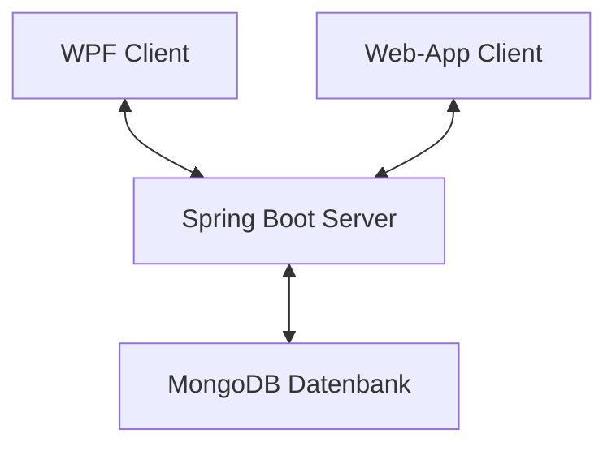

# POS-Semesterprojekt Dokumentation

## Architektur des Projekts
In diesem Projekt wird über eine WPF-Anwendung in C# (Client) und einer Web-Anwendung (Client) auf einen Spring Boot Server zugegriffen welcher Notizdaten aus einer MongoDB-Datenbank auslesen, verändern, löschen und hinzufügen kann. Es wurde also in einer Client-Client-Server-Architektur entwichelt. Hier ein Überblick der Architektur:

## Beschreibung der Notiz-App

Die Notiz-App ist eine vielseitige und benutzerfreundliche Anwendung, die entwickelt wurde, um Benutzern eine einfache und effiziente Möglichkeit zu bieten, ihre Notizen zu erstellen, zu verwalten und zu organisieren. Die App ist sowohl als Desktop-Anwendung (WPF) als auch als Webanwendung verfügbar, wodurch sie flexibel auf verschiedenen Geräten genutzt werden kann.

### Hauptfunktionen

1. **Erstellen von Notizen:**
   Benutzer können neue Notizen erstellen, indem sie Titel und Inhalt eingeben. Die Notizen können Texte, Listen, Links und andere Informationen enthalten, die für den Benutzer wichtig sind.

2. **Bearbeiten von Notizen:**
   Bestehende Notizen können jederzeit bearbeitet werden. Benutzer können den Inhalt aktualisieren, Änderungen speichern und die Notizen bei Bedarf neu organisieren.

3. **Löschen von Notizen:**
   Benutzer können Notizen, die sie nicht mehr benötigen, löschen. Diese Funktion hilft dabei, die Notizenliste sauber und organisiert zu halten.

4. **Liste von Notizen:**
   Alle Notizen werden in einer übersichtlichen Liste angezeigt. Benutzer können schnell durch ihre Notizen blättern, nach spezifischen Notizen suchen und direkt auf eine Notiz klicken, um sie anzuzeigen oder zu bearbeiten.

5. **Synchronisation zwischen Geräten:**
   Die Notiz-App synchronisiert Notizen zwischen der Desktop-Anwendung und der Webanwendung. Dadurch haben Benutzer stets Zugriff auf ihre aktuellen Notizen, unabhängig davon, welches Gerät sie verwenden.

### Benutzeroberfläche

Die Benutzeroberfläche der Notiz-App ist intuitiv gestaltet und ermöglicht eine einfache Navigation und Nutzung. Die Hauptfunktionen sind über klare und verständliche Schaltflächen zugänglich, und die Notizen werden in einer strukturierten und übersichtlichen Weise präsentiert.

### Technische Details

Die WPF-Anwendung bietet eine native Windows-Benutzererfahrung, während die Webanwendung plattformübergreifend in jedem modernen Browser läuft. Beide Clients kommunizieren mit einem zentralen Spring Boot-Server, der die Backend-Logik und die Verbindung zur MongoDB-Datenbank bereitstellt.

### Vorteile der Notiz-App

- **Flexibilität:** Benutzer können die App auf verschiedenen Geräten und Plattformen nutzen, wodurch sie ihre Notizen überall und jederzeit zur Hand haben.
- **Benutzerfreundlichkeit:** Die einfache und intuitive Benutzeroberfläche macht es auch weniger technisch versierten Benutzern leicht, die App zu nutzen.
- **Sicherheit:** Durch die Verwendung von MongoDB und Spring Boot wird sichergestellt, dass die Notizen sicher gespeichert und verarbeitet werden.
- **Effizienz:** Funktionen wie das schnelle Suchen und Bearbeiten von Notizen sparen Zeit und erhöhen die Produktivität.

## Erklärung der Notiz-App
### WPF-Anwendung

In der Mitte der Übersicht befinden sich alle aktuell in der Datenbank bestehenden Notizen. 
Mit dem Button Add kann man in einem neuen Fenster eine Neue Notiz erstellen und in die Datenbank hinzufügen.
Mit dem Button Delete kann man eine aktuell ausgewählte Notiz aus der Datenbank löschen.
Mit Doppelklick auf eine Notiz kann man diese verändern.

## WPF-Anwendung
Die WPF-Anwendung bietet eine benutzerfreundliche Oberfläche für Desktop-Benutzer, um Notizen zu erstellen, zu bearbeiten und zu löschen. Die Hauptfunktionalitäten werden durch die folgenden Komponenten bereitgestellt:

### MainWindow.xaml.cs
Die `MainWindow.xaml.cs` Klasse steuert das Hauptfenster der WPF-Anwendung. Sie lädt beim Start Notizen, ermöglicht das Hinzufügen, Bearbeiten und Löschen von Notizen und aktualisiert die Benutzeroberfläche entsprechend.

### MainWindow.xaml
Die `MainWindow.xaml` definiert die Benutzeroberfläche des Hauptfensters, einschließlich der Anordnung der Steuerelemente wie ListBox, Buttons usw.

### NoteWindow.xaml.cs und NoteWindow.xaml
Die `NoteWindow.xaml.cs` und `NoteWindow.xaml` Dateien sind verantwortlich für das Hinzufügen und Bearbeiten einzelner Notizen. Sie zeigen Eingabefelder für den Titel und den Inhalt der Notiz an.

### NoteService
Der `NoteService` behandelt die Kommunikation mit dem Server für CRUD-Operationen von Notizen. Er verwendet HTTP-Anfragen, um mit den entsprechenden Endpunkten auf dem Server zu interagieren.

### Note
Die `Note` Klasse repräsentiert eine einzelne Notiz mit Eigenschaften wie Titel, Inhalt und Erstellungsdatum.

## Web-Client
Die Webanwendung bietet eine plattformunabhängige Möglichkeit, auf die Notizen zuzugreifen und sie zu verwalten. Hier sind die Hauptkomponenten des Web-Clients:

### index.html
Die `index.html` Datei ist die Hauptdatei der Webanwendung. Sie definiert die Benutzeroberfläche und enthält das HTML-Grundgerüst, das für die Darstellung der Notizen und die Interaktion mit dem Benutzer erforderlich ist.

### styles.css
Die `styles.css` Datei enthält die CSS-Stile für die Benutzeroberfläche, um ein ansprechendes Design und Layout zu gewährleisten.

### script.js
Die `script.js` Datei enthält JavaScript-Code, der für die Interaktivität der Benutzeroberfläche verantwortlich ist. Sie enthält Funktionen zum Laden, Bearbeiten, Hinzufügen und Löschen von Notizen über AJAX-Anfragen.

## Java SpringBoot Server
Der Spring Boot-Server fungiert als Backend für die Anwendung und bietet die notwendige Logik für das Management von Notizen. Hier sind die Hauptkomponenten des Servers:

### NoteController
Der `NoteController` ist für das Entgegennehmen von HTTP-Anfragen und das Weiterleiten an den entsprechenden Service verantwortlich. Er verarbeitet Anfragen für das Erstellen, Lesen, Aktualisieren und Löschen von Notizen.

### NoteDTO, NoteEntity, NoteRepository, MongoDBNoteRepository
Diese Klassen repräsentieren Datenübertragungsobjekte, Entitäten und Repositories für Notizen sowie die Integration mit der MongoDB-Datenbank. Sie ermöglichen das Speichern, Lesen, Aktualisieren und Löschen von Notizen in der Datenbank.

## Zusammenfassung
Das POS-Semesterprojekt bietet eine benutzerfreundliche Lösung zur Verwaltung von Notizen über verschiedene Plattformen hinweg. Die Kombination aus einer Desktop- und einer Webanwendung bietet Flexibilität für Benutzer mit unterschiedlichen Präferenzen.

## Quellcode
- [WPF-Anwendung](link_zum_wpf_repo)
- [Web-Client](link_zum_webclient_repo)
- [Spring Boot Server](link_zum_springboot_repo)
